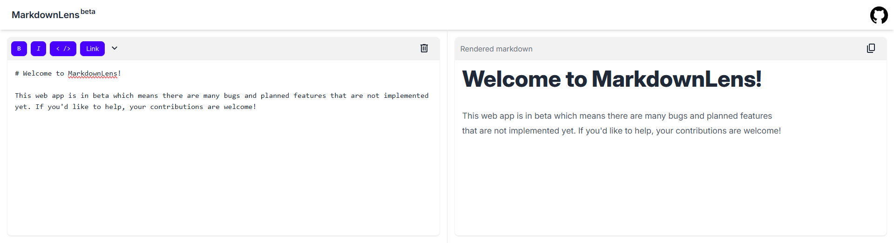

# MDlens: A Real-Time Markdown Viewer ✨



**MDlens** is a modern markdown editor and previewer built with **React**, **Tailwind CSS**, and **Marked.js**. With its simplistic UI, users can seamlessly write, edit, and preview markdown side-by-side, without distractions. MDlens empowers developers, writers, and content creators with tools for clean and efficient markdown formatting.

---

## Features 🎨

- **Live Markdown Preview**: See changes in real time as you type.
- **Responsive Design**: Adapts seamlessly to any screen size, offering a side-by-side layout for desktops and a stacked view for mobile.
- **Formatting Toolbar**: Bold, italicize, or create headers effortlessly using a user-friendly toolbar.
- **Simplistic UI**: Tailwind CSS and DaisyUI offer a modern, accessible design.
- **Markdown Rendering**: Powered by Marked.js, supporting a wide range of markdown syntax.

---

## Demo 🚀

Check out a live version of MDlens [here](https://md-lens.vercel.app/).

---

## Table of Contents 📚

1. [Getting Started](#getting-started)
2. [Installation](#installation)
3. [Usage](#usage)
4. [Contributing](#contributing)
5. [License](#license)
6. [Acknowledgments](#acknowledgments)

---

## Getting Started 💻

Follow these instructions to set up MDlens on your local machine for development or testing.

### Prerequisites

- Node.js (v16 or later)
- npm (v8 or later) or yarn (optional)

### Installation

1. Clone the repository:
   ```bash
   git clone https://github.com/your-username/MDlens.git
   ```
2. Navigate to the project directory:
   ```bash
   cd MDlens
   ```
3. Install dependencies:
   ```bash
   npm install
   ```

### Running the project

1. Start the development server:
   ```bash
   npm run dev
   ```

## Usage 🖋️

1. **Write Markdown**: Use the editor on the left to type raw markdown.
2. **Preview Changes**: Watch your markdown render live on the right panel.
3. **Apply formatting**: Highlight text and use the toolbar for bold, italics, headers, and more.

## Contributing 🤝

We welcome contributions to improve MDlens! Follow these steps to contribute:

1. Fork this repository.
2. Create a feature branch:
   ```bash
   git checkout -b feature-name
   ```
3. Commit your changes:
   ```bash
   git commit -m "Add new feature"
   ```
4. Push the branch:
   ```bash
   git push origin feature-name
   ```
5. Open a Pull Request on GitHub.

## License 📄

This project is licensed under the MIT License. See the [LICENSE](LICENSE) file for details.

## Acknowledgments 🙌

Special thanks to the following technologies and libraries that made this project possible:

- [React](https://reactjs.org/)
- [Tailwind CSS](https://tailwindcss.com/)
- [DaisyUI](https://daisyui.com/)
- [Marked.js](https://marked.js.org/)

Feel free to reach out or create an issue for any questions or suggestions. We hope you enjoy using **MDlens** as much as we enjoyed building it! 😊
